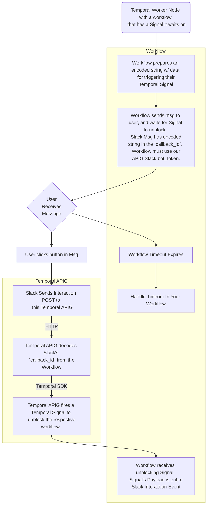

# Temporal API Gateway
A monorepo for translating HTTP events to Temporal SDK calls. 

**[Please read the current Limitations](#current-limitations)**

Crates in this repo:
- [Temporal API Gateway Server](./crates/apig_server/README.md)
- [JSON Models & String Encoder/Decoder for the webserver](./crates/temporal-json/README.md)
- [NodeJS Bindings to the Encoder (with examples for usage from a Temporal Workflow)](./crates/temporal-json-node/README.md)
- [Helper utils for using Temporal from Rust](./crates/temporal-sdk-helpers/README.md)

___

## What is it?

1. A string encoder for compressing a custom JSON payload into a short-length string
2. Language bindings for accessing the string encoder natively from other languages.
3. A Webserver that enables a JSON payload sent over HTTP to interact with Temporal: triggering a new workflow, sending information to a running workflow, unblocking a paused workflow, etc.
    1. The server also has endpoints for receiving Interaction Events directly from Slack.
    
This combination of features allows developers to **write a Temporal Workflow that blocks, waiting for the "unblock Signal" from an external HTTP source WITHOUT direct access to the Temporal SDK**.

Your workflow can send an interactive message to users via Slack, using our Encoder to embed your workflow's routing info in the Slack Message (the `callback_id`). When the user clicks a button in your message, that 'Interaction Event' from Slack is received by this webserver which decodes your `callback_id` to route the Interaction Event back to your waiting Workflow.

## Diagrams

#### Sending a Slack Message and Waiting For User's Response
Process for sending a Slack Message from your Temporal Workflow, waiting for a user to interact with it, and handling the Slack Interaction Event from your same workflow.



## Current Limitations
1. The only routes available in Prod are for receiving **Slack Interaction Event** payloads, and for encoding a string via HTTP so this can be used from languages without direct bindings (see point 2).
    1. Interaction Events from Slack [must be verified](https://api.slack.com/authentication/verifying-requests-from-slack), which means the APIG needs to know the individual Slack Bot's `Signing Secret`.
    2. The Temporal APIG url must be provided to the Slack bot for Interaction events, meaning the bot can't send interaction events to any other location
    3. **TLDR: Currently you must use our bot token when using the Slack SDK in your Workflow if you want to block and wait for a response from a slack user.**
        1. Luckily you can [name the bot whatever you like when sending the message](https://api.slack.com/messaging/sending#impersonation) from your workflow, so users won't see "Temporal APIG Bot"
2. We currently only have native language bindings for NodeJS and Rust (& soon Python). If you want your Workflow to use a different language, we provide an Encoder route as well:
    1. Gather the necessary workflow data from the Temporal Context in your workflow's Activity
    2. Format a JSON payload as seen below, or [in the test case `test_encode_endpoint_v1_signal` in **./crates/apig_server/src/main.rs**](./crates/apig_server/src/main.rs)
    3. Send the payload to `<apig_url>/api/v1/temporal/encode`. You will receive an encoded String, which you must provide as the `callback_id` in your Slack message api call.
3. `callback_id` length and Custom Data: The V1 string encoder may require up to 170 characters, and Slack's char limit is 255. You can add up to 80 chars of your own custom data that will also ride along in the callback_id by:
    1. encoding the temporal payload like normal
    2. adding a delimiter character `~` to the END of the encoded string
    3. adding up to 80 chars after the delimiter
    4. double checking that the new string length is less than 255 (the slack api call will fail otherwise).
    
**Temporal APIG Signal - JSON Payload**
```json
{
    "type" : "Signal",
    "namespace" : "my-namespace",
    "task_queue": "my-taskqueue",
    "run_id": "some-run-id",
    "workflow_id":"some-workflow-id",
    "signal_name": "my_signal_name"
}
```